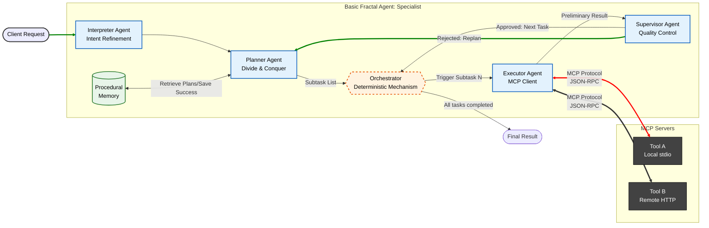
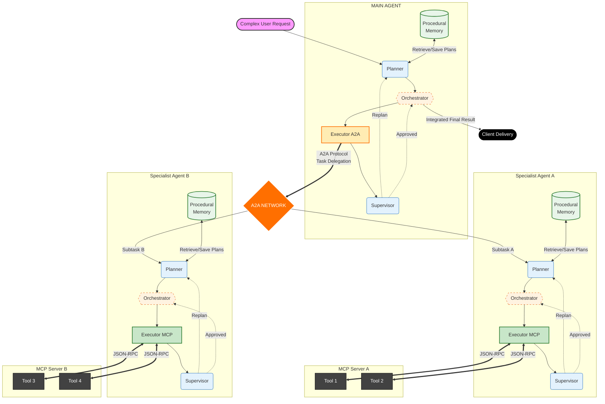
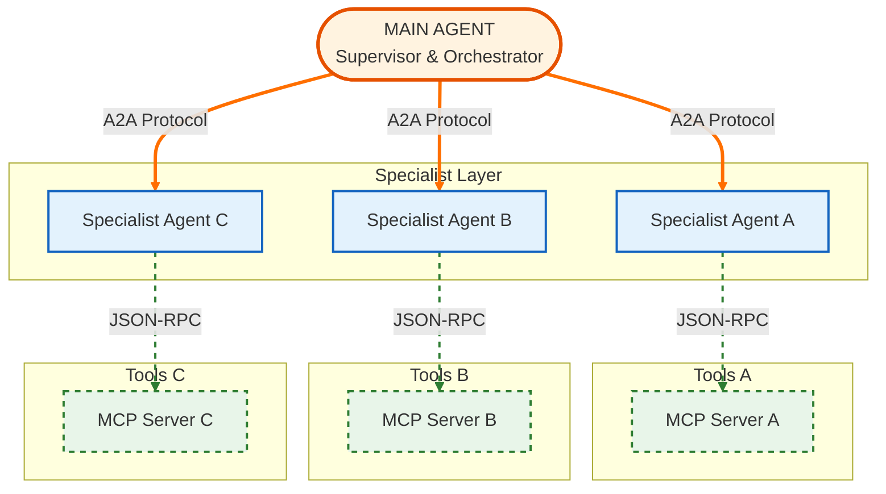
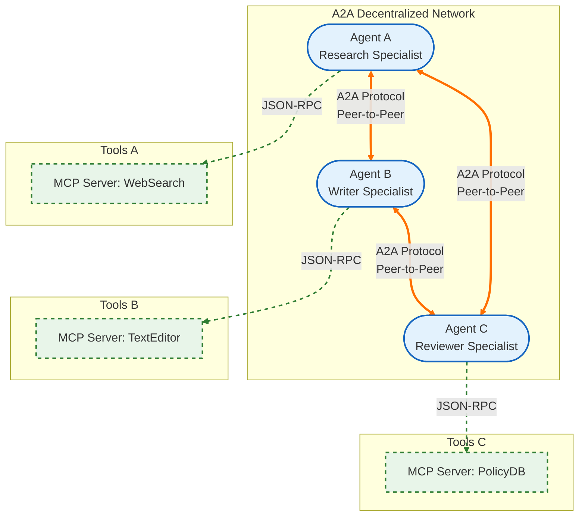
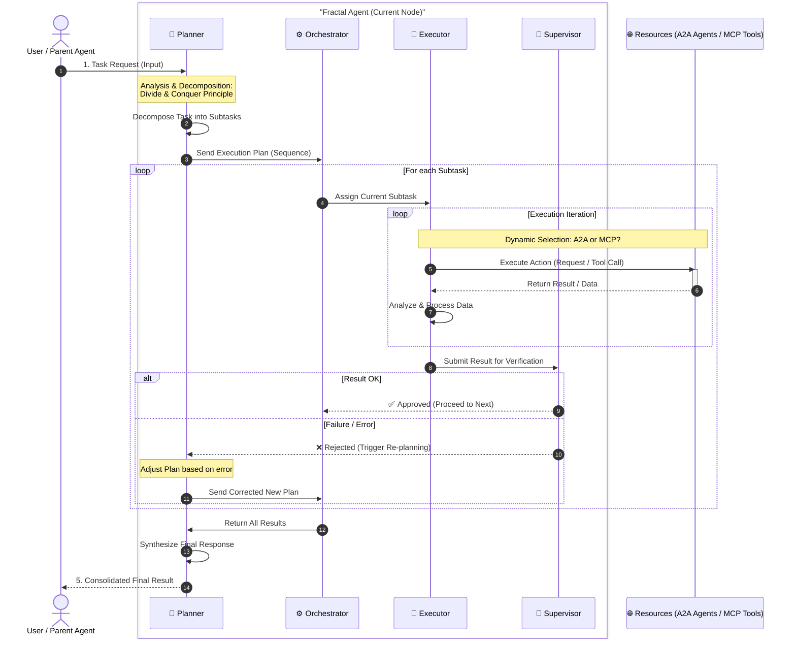

## From Individual Autonomy to Orchestrated Intelligence

In Artificial Intelligence (AI), an agent is formally conceptualized as an autonomous software entity designed to perceive its environment through various inputs and act upon it through executable outputs, such as API calls, to achieve specific goals <d-cite key="ehtesham2025surveyagentinteroperabilityprotocols,li_survey_2024"></d-cite>. The integration of Large Language Models (LLMs) has transformed these agents, enabling them to transcend simple stimulus-response mechanisms and incorporate advanced reasoning and complex planning capabilities <d-cite key="10.1007/BFb0013570,JENNINGS2000277,ehtesham2025surveyagentinteroperabilityprotocols"></d-cite>.
<blockquote>
    AI agents offer a unique opportunity to help people be more productive by autonomously handling many daily recurring or complex tasks.
    — Surapaneni et al. (2025) <d-cite key="googlecloud2025a2a"></d-cite>.
</blockquote>

However, complexity intensifies when scaling to Multi-Agent Systems (MAS), defined as collections of orchestrated agents designed to enable collective intelligence that surpasses individual capabilities through task decomposition, context isolation, and performance parallelization <d-cite key="10.1145/3712003"></d-cite>. In these systems, multiple specialized agents collaborate to achieve common goals; however, this architectural sophistication introduces critical coordination and interoperability challenges that, without adequate standardization, often result in systemic fragility and operational failures <d-cite key="pan2025why"></d-cite>.

## The Future of MAS — Standardization

Currently, the agent ecosystem suffers from critical fragmentation. Enterprise systems often consist of agents built upon disparate technology stacks and frameworks (such as LangChain, AutoGen, or proprietary implementations), resulting in siloed behaviors and inefficient collaboration <d-cite key="ehtesham2025surveyagentinteroperabilityprotocols"></d-cite>. This lack of interoperability forces developers to build ad-hoc integrations that are difficult to scale, insecure, and fragile to changes <d-cite key="ehtesham2025surveyagentinteroperabilityprotocols"></d-cite>. In essence, each agent speaks its own "dialect," creating communication barriers that prevent collective intelligence from emerging naturally. Without a shared framework for dynamic negotiation and capability exchange, agents remain as isolated silos of intelligence, unable to coordinate complex actions beyond their preprogrammed boundaries.

Standardization is not merely a technical convenience; it is the essential catalyst for the next phase of AI. Much like HTTP and TCP transformed a fragmented network of incompatible servers into the World Wide Web, modern protocols such as the Model Context Protocol (MCP), introduced by Anthropic in November 2024 <d-cite key="anthropic2024modelcontextprotocol"></d-cite>, and Agent-to-Agent (A2A), launched by Google in April 2025 <d-cite key="googlecloud2025a2a"></d-cite>, are converging to establish a universal interoperability layer for the AI ecosystem.



The adoption of these open standards stands as a strategic imperative for three fundamental reasons: first, it eliminates integration friction by decoupling interface from implementation, allowing agents developed by heterogeneous teams and organizations to collaborate without exposing their internal architecture <d-cite key="ehtesham2025surveyagentinteroperabilityprotocols,a2a_protocol_2025"></d-cite>. Second, it drives scalability and modularity by preventing the reinvention of incompatible components, empowering developers to focus on agent role specialization while delegating interoperability to the protocol infrastructure <d-cite key="googlecloud_mcp_2025,habler2025buildingsecureagenticai,liao-etal-2025-agentmaster"></d-cite>. Finally, it ensures the cohesive evolution of the ecosystem against fragmentation, laying the foundation for a future where complex problem-solving through collaborative AI becomes a distributed and seamless endeavor, thereby maximizing the potential of multi-agent architectures <d-cite key="googlecloud2025a2a"></d-cite>.

<blockquote>
    We believe that this protocol will pave the way for a future where agents can seamlessly collaborate to solve complex problems and enhance our lives.
    — Surapaneni et al. (2025) <d-cite key="googlecloud2025a2a"></d-cite>.
</blockquote>

### The Convergence of MCP and A2A

To realize the vision of an interoperable ecosystem, it is necessary to adopt standards that decouple intelligence (the model) from execution (tools and collaboration). In this context, the MCP emerges as the standard for Agent-to-Tool integration. MCP addresses the inherent limitation of LLMs as closed and static systems by providing a universal and secure interface to connect AI assistants with databases, document repositories, and external APIs <d-cite key="ehtesham2025surveyagentinteroperabilityprotocols"></d-cite>. By standardizing these connections via JSON-RPC, MCP eliminates the quadratic complexity of building $N \times M$ integrations for every provider, reduces hallucinations through grounded data access (RAG), and ensures security via "human-in-the-loop" mechanisms and granular access control <d-cite key="googlecloud_mcp_2025"></d-cite>.

However, tool access alone is insufficient for complex problem-solving that requires multiple domains of expertise. This is where the A2A protocol steps in to facilitate Agent-to-Agent integration. A2A acts as a social layer protocol that enables heterogeneous agents—built on diverse stacks such as LangGraph, CrewAI, or others—to discover each other via "Agent Cards," authenticate their identities, and asynchronously negotiate long-running tasks. Unlike MCP, which focuses on function execution, A2A centers on goal delegation and secure orchestration, allowing each agent to operate as a specialized black box, preserving its autonomy while hiding its internal complexity from the rest of the network <d-cite key="a2a_protocol_2025"></d-cite>.

The combination of A2A and MCP is complementary (see Figure 1): while MCP enables the agent to act upon its environment, A2A allows it to coordinate with other agents <d-cite key="habler2025buildingsecureagenticai"></d-cite>. Both share a common technical DNA based on JSON-RPC and standard transports (HTTP/SSE), reducing implementation friction and computational overhead <d-cite key="a2a_protocol_2025,googlecloud_mcp_2025,ehtesham2025surveyagentinteroperabilityprotocols"></d-cite>.



Figure 1: A2A and MCP are complementary standards<d-cite key="a2a_protocol_2025"></d-cite>.

This convergence creates the ideal foundation for robust systems; however, while these protocols provide the groundwork, current literature lacks a reference architecture describing how to structure these components to maximize efficiency and minimize entropy in complex systems. It is within this architectural gap that we propose FRACTAL-MAS, a recursive design that leverages the native compatibility of these standards to build a MAS.

## FRACTAL-MAS

Our proposed architecture, FRACTAL-MAS, is grounded in the premise that complexity should not be managed through the addition of heterogeneous components, but rather through structural self-similarity. Based on the computational principles of "Divide and Conquer" (solving a difficult problem by breaking it down into simpler parts as many times as necessary <d-cite key="Ephrati1994DivideAC"></d-cite>) and Recursion (when the definition of a concept or process depends on a simpler or previous version of itself <d-cite key="doi:10.3233/ICA-2004-11206"></d-cite>), FRACTAL-MAS proposes that the structure of the MAS must be isomorphic to the structure of an individual agent.

### Basic FRACTAL Agent

At the lowest level of abstraction, we define the "Basic Fractal Agent" not as a generalist, but as a strict specialist (e.g., a calculation agent or an HR microservice). This agent operates under an autonomous control loop designed to mitigate common failure modes in LLM orchestration, such as lack of verification or context loss <d-cite key="pan2025why"></d-cite>.

The internal anatomy of this agent consists of decoupled functional modules:

**Procedural Memory:** A critical component for robustness. Unlike simple semantic memory, this module retrieves "execution traces" or successful action plans from previous tasks. This grounds the planner, drastically reducing hallucinations by basing future actions on validated past experiences, similar to Case-Based Reasoning (CBR) mechanisms observed in recent architectures like Memento <d-cite key="zhou2025mementofinetuningllmagents"></d-cite>.

**Planner Agent:** Utilizing LLM reasoning capabilities, it is responsible for applying the Divide and Conquer principle to decompose the main task into an execution graph of discrete subtasks. This agent does not merely list actions but defines the logic of their relationships, identifying which tasks are sequential (dependent) and which can be executed in parallel.

**Orchestration Mechanism:** Unlike intelligent components, this is a deterministic, non-LLM-based execution engine. Its function is strictly operational: it administers the control flow defined by the planner, managing the execution queue and ensuring that preconditions and blocking dependencies are respected before activating the executor agent. Being deterministic ensures that the logical order of tasks is adhered to without hallucinations.

**Executor Agent (The MCP Client):** Acts as an intelligent MCP Client that translates abstract subtasks into concrete actions. Thanks to the MCP, this agent dynamically discovers available tools (databases, APIs, scripts) and manages their secure execution. By abstracting the technical implementation via MCP, the Executor operates agnostically to the infrastructure, ensuring standardization and security in every interaction with the external world <d-cite key="zhou2025mementofinetuningllmagents,liao-etal-2025-agentmaster"></d-cite>.

**Supervisor Agent:** A quality control module that verifies the executor's output before marking the subtask as complete <d-cite key="li_survey_2024"></d-cite>. If the result is deficient, it triggers a feedback loop (replanning), preventing cascading error propagation <d-cite key="zhou2025mementofinetuningllmagents"></d-cite>.

Diagram 1: Basic FRACTAL Agent.

### FRACTAL-MAS Structure

The core innovation of FRACTAL-MAS lies in its recursive scalability. Traditionally, MAS architectures suffer from infinite loops or bottlenecks in centralized supervisors <d-cite key="li_survey_2024, yamamoto2025dynamic"></d-cite>. Our proposal addresses this by applying the same "Basic Agent" topology to the "System" level.

At the top level (MAS), the system behaves as a single "Fractal Agent," featuring the same components (Planner, Supervisor, etc.). However, a critical difference exists within the execution layer: while the Basic Agent uses MCP to orchestrate tools, the MAS Main Agent utilizes the A2A protocol to orchestrate other Agents.

This distinction enables a hybrid and robust architecture. The Main Agent delegates a complex subtask to a Specialist Agent via A2A. To the Main Agent, this specialist functions as a "black box" that receives an input and returns a validated output. Internally, that Specialist Agent decomposes the task and utilizes its own tools via MCP. This encapsulation, guaranteed by the A2A protocol, ensures that no agent shares memory or internal state, thereby preserving security and operational independence <d-cite key="habler2025buildingsecureagenticai"></d-cite>.

Diagram 2: FRACTAL-MAS Structure.

### Agent-as-a-Tool in FRACTAL-MAS

FRACTAL-MAS enables a seamless transition from a rigid hierarchy to a dynamic network. Since each agent exposes its capabilities through standardized interfaces (A2A Server) and consumes services (A2A Client), any specialist agent can, in turn, discover and subcontract other agents if the task demands it; that is, an agent can simultaneously function as both an A2A Client and Server.

This enables the "Agent-as-a-Tool" concept: the ability to treat a complex autonomous system as if it were a simple tool. This flexibility allows the system topology to evolve from a hierarchical (centralized) structure into a decentralized network structure

Diagram 3: FRACTAL hierarchical (centralized) structure.

Diagram 4: FRACTAL decentralized network structure.

### Unified FRACTAL Control Loop

Diagram 5 illustrates the theoretical implementation of the Fractal Control Loop, the core mechanism governing the behavior of each node within the FRACTAL-MAS architecture. Unlike traditional linear workflows, this design proposes a unified and resilient execution pipeline operating across three critical phases:

**Strategic Decomposition (Planner):** Upon receiving a request, the agent does not act immediately. The Planner applies the Divide and Conquer principle to decompose user intent into a logical sequence of subtasks, minimizing the cognitive complexity of each step.

**Polymorphic Execution (Executor):** During the execution phase, the system demonstrates its flexibility. The Executor Agent iterates through available resources and dynamically selects the appropriate protocol: MCP for direct data manipulation (Tools) or A2A for the delegation of cognitive capabilities (Child Agents). This abstraction enables the agent to scale its problem-solving capacity without altering its internal logic.

**Quality Assurance and Self-Correction (Supervisor):** The distinctive component of this architecture is the integration of a strict Supervisor within the loop. No result is considered final until validated. If the Supervisor detects inconsistencies or hallucinations, it rejects the output and triggers a Re-planning event, closing the feedback loop and ensuring that errors are corrected locally before propagating to the rest of the system.

Diagram 5: Theoretical implementation of the Fractal Control Loop.

### Procedural Memory — Continuous Learning

In the FRACTAL-MAS architecture, intelligence does not reside solely in the LLM's reasoning capabilities but in the systematic accumulation of operational experience. We define Procedural Memory as the core that allows the system to evolve over time, transforming past executions into future heuristics for problem-solving. This functionality is theoretically grounded in Case-Based Reasoning (CBR), a cognitive paradigm that enables agents to solve novel problems by retrieving and adapting successful solutions from previous experiences <d-cite key="464654"></d-cite>. Instead of starting from scratch with every request, the agent consults a "case bank" that stores successful execution traces (state, plan, reward), using memory to guide the Planner.

This proposal aligns with recent research such as Memento <d-cite key="zhou2025mementofinetuningllmagents"></d-cite>, which has demonstrated the feasibility of adapting an agent's behavior without incurring the computational cost of parameter retraining (fine-tuning). Memento implements this online learning by storing traces of past episodes and utilizing sophisticated retrieval mechanisms, such as parametric variants that train a multilayer perceptron (MLP) to score and classify the utility of memories according to the current context. By integrating CBR, the FRACTAL-MAS Planner not only generates logical steps but retrieves proven plans, drastically reducing hallucinations and improving operational efficiency by avoiding previously committed errors.

Given the recursive design of our architecture, procedural memory performs isomorphic functions at each level of abstraction. In the Main Agent, memory assists the Planning node in decomposing complex tasks, recalling which combination of agents contacted via A2A best resolved a similar request in the past. Simultaneously, in the Specialist Agent, memory guides the decomposition of the subtask into atomic actions, learning which sequence of tool calls via the MCP protocol is the most efficient for manipulating data within its specific domain.

Our proposal postulates that procedural memory is an elemental principle of MAS and should not be bound to a single technical implementation. FRACTAL-MAS is agnostic to the retrieval method, framing this mechanism as an adaptable heuristic that varies according to the agent's nature. This allows for the implementation of hybrid strategies ranging from semantic similarity for contextual understanding or lexical matching for technical terms, to the use of knowledge graphs or trainable scoring models like the Q-function in Memento <d-cite key="zhou2025mementofinetuningllmagents"></d-cite>. This flexibility allows each node in the network to optimize its own learning curve independently.

## Conclusions

In this post, we have presented FRACTAL-MAS, a theoretical architecture that proposes a paradigm shift in the design of MAS, transitioning from ad-hoc orchestration toward structural self-similarity. By applying principles of recursion and decomposition (Divide and Conquer), we have demonstrated that managing complexity in modern tasks does not require the addition of heterogeneous components, but rather a robust modular design that replicates fractally across all scales of the system, from the individual specialist agent to the global network.

The operational viability of this proposal rests on the convergence of standardized protocols that decouple control logic from technical implementation. The integration of MCP for tool interaction and A2A for agent coordination establishes a unified interface abstraction layer. This standardization eliminates integration friction and guarantees syntactic and semantic interoperability, allowing heterogeneous components to collaborate under strict and secure communication contracts, thereby overcoming the technical fragmentation that currently limits ecosystem scaling.

Simultaneously, the architecture redefines the system's adaptive capacity through the incorporation of Procedural Memory grounded in Case-Based Reasoning (CBR). This mechanism transforms the system into an entity capable of continuous learning (online learning), where successful execution traces become heuristics for future iterations. This allows for constant operational optimization and mitigates planner hallucinations through the reuse of validated strategies, all without incurring the computational costs of model retraining (fine-tuning).

Finally, by standardizing input and output interfaces, FRACTAL-MAS enables the "Agent-as-a-Tool" paradigm, endowing the architecture with intrinsic topological flexibility. This allows the organizational structure to evolve organically from centralized hierarchies to decentralized networks, where any agent can act simultaneously as client and server, maximizing resilience and scalability. Ultimately, FRACTAL-MAS lays the necessary infrastructure for the seamless and standardized orchestration of distributed specialists.

## Future Work

While FRACTAL-MAS provides a robust theoretical foundation for scalable orchestration, we acknowledge that its recursive nature inherently introduces a higher computational overhead compared to traditional flat architectures. Moving forward, our immediate focus is to empirically evaluate this cost-benefit trade-off to determine the exact complexity thresholds where the benefits of our approach outweigh the orchestration costs. Additionally, we plan to establish formal operational boundaries, such as defining the ideal recursion depth parameter to strictly prevent infinite replanning loops. Finally, to fully validate this framework, future implementations will be tested on complex, long-horizon, and multi-domain tasks, moving beyond standard, simplified benchmarks to demonstrate the true potential of fractal orchestration.