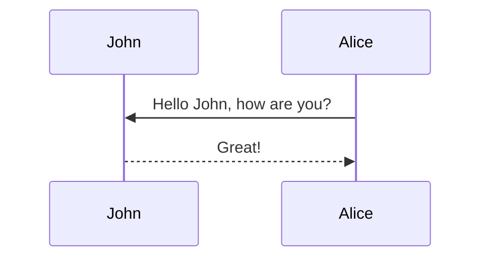

Note: please use the table of contents as defined in the front matter rather than the traditional markdown styling.

## Deployed model = Happy ML Engineer?

You are a machine learning engineer and you work for a bank. You create a model to predict the default risk of applicants. Your model works very well on your test set. The company decides to deploy your model, making you worry about performance in the real-world. However, these are unfounded fears: your model works well the following weeks after deployment. Everyone congratulates you and you are satisfied because you did your work well.

But… after some time, you realize that the model is not performing as well anymore. Repeat applicants have changed their financial characteristics to have a higher chance of getting the loan. These reapplicants have learned to “game” your model. New applicants do not follow the training distribution anymore. The very deployment of your model has triggered a distribution shift in the data!

Once an ML model is deployed, it undoubtedly has an effect in the real world. This effect has been largely overlooked in Machine Learning, as model deployment is often the final step that the ML engineer is involed in. But if you want your model to work in practice, you need to take these effects into account.

Scenarios like the one described above have been formalized in the field of <em>performative prediction</em><d-cite key="perdomo2020performative"></d-cite>. Performative Prediction studies when deploying a model causes a distribution shift in the data. Let $$\theta$$ be the model parameters <d-footnote>Thought the text, we will use $\theta$ to refer both the model parameters and the model itself.</d-footnote>. PP literature studies this effect as a dependency of the data distribution on $$\theta$$ through a <em>distribution map</em>, $$\mathcal{D}(\theta)$$, a function from the set of model parameters to the space of data distributions. For a given model, $$\mathcal{D}(\theta)$$ gives the data distribution induced by the model parameters $$\theta$$. 

The following diagram illustrates the conceptual differences between traditional Machine Learning and Performative Prediction. On the left-hand side, we have the situation in the typical ML setup: there is a fixed data distribution $$\mathcal{D}$$ on which we train our model $$\theta$$. On the right-hand side, we have the performative prediction setup: the distribution map $$\mathcal{D}(\theta)$$ defines a data distribution on which we train our model $$\theta$$, but in turn, the model parameters affect the data distribution.



In order to formalize this feedback loop between the model and the data distribution, we describe it as an iterative process, which is shown in the following diagram. Before the process begins, we have an initial data distribution $$\mathcal{D}_0$$, on which the first model $$\theta^{(0)}$$ is trained. From the first model, we get the initial distribution $$\mathcal{D}(\theta^{(0)})$$, the data distribution induced by the model parameters $$\theta^{(0)}$$. At each subsequent time step, we obtain a model $$\theta^{(t+1)}$$ trained on the data distribution $$\mathcal{D}(\theta^{(t)})$$ (see section XX for more information on the optimization algorithms). And then, the model is deployed, which causes a new distribution shift to $$\mathcal{D}(\theta^{(t+1)})$$. This distribution shift is automatic and happens because of the mere deployment of the model:



The fact that the environment reacts to our model makes it difficult to evaluate the performance of the model. In the traditional ML setup, we can measure the performance of a model on a fixed data distribution, but we cannot do this in the performative prediction setup.

## How to measure performance of the model then?

In Performative Prediction, evaluating a model’s performance requires acknowledging that the data distribution depends on the model itself. Thus, when the model is updated from $\theta^{(t)}$ to $\theta^{(t+1)}$, we need to measure two different risks: the risk of the updated model $\theta^{(t+1)}$ under the previous distribution $\mathcal{D}(\theta^{(t)})$ (i.e., the distribution before deployment), and the risk of the same model $\theta^{(t+1)}$ under the new distribution $\mathcal{D}(\theta^{(t+1)})$ (i.e., the distribution after it reacts to. The <em>decoupled performative risk</em> will allow us to do both. For the sake of clarity, we will introduce the notation $$\theta_M$$ to refer to the parameters of the model we want to evaluate and $$\theta_D$$ to refer to the parameters of the the model that defines the data distribution.

The decoupled performative risk is then simply the risk of a model $$\theta_M$$ on the distribution $$\mathcal{D}(\theta_D)$$:

$$ \mathcal{DPR}(\theta_D, \theta_M) := \mathbb{E}_{(x,y) \sim \mathcal{D}(\theta_D)} \big[\ell(\theta_M, x, y)\big] $$

where $$\ell(\theta, x, y)$$ is the loss function of the model $$\theta$$ on the data sample $$(x,y)$$. 

Ultimately, we are, however, mostly interested in the risk of the model on the distribution <em>induced by its own parameters</em>. This risk is referred to as the <em>performative risk</em> and is defined like this:

$$ \mathcal{PR}(\theta) := \mathcal{DPR}(\theta, \theta) = \mathbb{E}_{(x,y) \sim \mathcal{D}(\theta)} [\ell(\theta, x, y)] $$

The performative risk captures the risk after the automatic distribution shift due to model deployment, so after some time the risk will no longer be $$\mathcal{DPR}(\theta^{(t)}, \theta^{(t+1)})$$ but $$\mathcal{PR}(\theta^{(t+1)})$$. Note that compared to the risk in the traditional ML setup, in the performative risk the data distribution is not fixed but depends on $$\theta$$.



### Visualizing the decoupled risk 

Therefore, distribution shift in PP occurs only after deployment. As a result, the performative risk is not a valid evaluation metric immediately after optimization. This is because it reflects the expected loss on a distribution that the model itself induces. To have a full understanding of the optimization landscape, we need to take then a look beyond the performative risk. The decoupled risk serves as a good vizualization technique.


Note that the performative risk is the section of the plane where $$\theta_M=\theta_D$$. 

Now it's easier the two step process!

Javi: add a figure that compares the performative risk with the decoupled risk. and obtains the previuos plot

## Interest points of performative prediction
      
One natural solution to the problem of performative prediction is deploying a model that — after it has affected the data distribution — does not require retraining, i.e., a model robust to the distribution shift. This model will be optimal for the distribution induced by itself:

$$ \theta_{ST} = \operatorname*{argmin}_{\theta} \mathbb{E}_{(x,y)\sim \mathcal{D}(\theta_{ST})}[\ell(\theta, x, y)] $$

However, this solution is not optimal for the closed-loop interaction between the data and the model, i.e. it is not the minimum of the performative risk. The minimum of the performative risk is called the performative optimum. 

$$ \theta_{OP} = \operatorname*{argmin}_{\theta} \mathcal{PR}(\theta) = \operatorname*{argmin}_{\theta} \mathbb{E}_{(x,y)\sim \mathcal{D}(\theta)}[\ell(\theta, x, y)] $$



Figure xx shows the stable and optimal points in the decoupled risk landscape visualization. We can redefine stable and optimal points based on the visualization.  Keep in mind that both points lie in the $\theta_M=\theta_D=\theta$ section of the decoupled risk landscape.

Add propositions. 

We argue that this redefinitions (or a relaxation of them) can be found useful when practically analysing realistic scenarios in PP. 

## How to reach them?

The performative prediction literature started out by focusing on how to find <em>the stable solution</em>, as it is more mathematically tractable. The first algorithms were based on retraining the model. The process of these algorithms can be summarized as:

1. Get the data samples of the distribution induced by $$\theta^{(t)}$$: $$ (x,y)\sim \mathcal{D}(\theta^{(t)})$$
2. Train the model on those data samples: $$\theta^{(t)} \rightarrow \theta^{(t+1)}$$
3. Deploy the model, causing a new distribution shift: $$\mathcal{D}(\theta^{(t)}) \rightarrow \mathcal{D}(\theta^{(t+1)})$$

If the model is fully optimized at each step, we call this algorithm <em>Repeated Risk Minimization</em> (RRM): if only one optimizer step is performed, we call it <em>Repeated Gradient Descent</em> (RGD) and if it is several gradient steps, we call it k-greedy RGD.

The convergence guarantees of these algorithms to the stable point rely on the convexity of the loss function $$\ell(\theta, x, y)$$ with respect of the model parameters $$\theta$$ and on the sensitivity of the distribution map, $$\mathcal{D}(\theta)$$, with respect to the model parameters, $$\theta$$, i.e. a small change in the parameters will give a similar distribution map. It is quite intuitive to see why these are needed assumptions: if the loss is convex and the distribution shift is small, the new loss will be also convex. Nevertheless, these are very uncommon in practice, a convex loss is rare and the distribution map is only sensitive if the performative effects are small.  

Note that these algorithms do not use the information of the distribution map when training the model. They just use the data sampled from the shifted distribution. This distribution is considered to be static. Although it is very easy to apply them in practice (wait until the distribution shifts, observe new data samples and retrain), it takes many steps to converge and does not find the optimal solution, as it does not use the information of the distribution map while training the model. In these initial algorithms, the only guarantee to optimality is that the stable point might lie close to the optimal point under certain conditions, which cannot be checked in practice.

Later, the literature started focusing on how to find the optimal solution directly. The most immidiate idea is to apply gradient descent to the performative risk — Performative Gradient Descent (PerfGD). The key step here is to calculate the performative gradient:

$$ \nabla_{\theta} PR(\theta) = \nabla_{\theta} \mathbb{E}_{(x,y) \sim \mathcal{D}(\theta)} [\ell(\theta, x, y)]~. $$ 
      
This gradient is difficult to calculate due to the dependency of the data distribution on the model parameters. (When finding the stable point, one need only to calculate $$\mathbb{E}_{(x,y) \sim \mathcal{D}(\theta)} [ \nabla_{\theta} \ell(\theta, x, y)]$$; that is why it is more mathematically tractable.) Two possibilities have been proposed: REINFORCE<d-cite key="izzo2021learn"></d-cite> and the reparametrization trick<d-cite key="cyffers2024optimal"></d-cite>.



## Conclusion

Now imagine you are a machine learning engineer working in the company of your dreams. You have been hired some time ago and you are excited because you worked on the next big thing. The soon-to-be-released model that works amazingly well in your test sets — AGI is just around the corner! But… have you considered the effects that this model will have on the data distribution? If the internet is populated with text and images created by your model… you might not be able to train the next model.

And it seems that retraining is not enough…

## Some thoughts about the practicallity of the field


## Equations

This theme supports rendering beautiful math in inline and display modes using [MathJax 3](https://www.mathjax.org/) engine.
You just need to surround your math expression with `$$`, like `$$ E = mc^2 $$`.
If you leave it inside a paragraph, it will produce an inline expression, just like $$ E = mc^2 $$.

To use display mode, again surround your expression with `$$` and place it as a separate paragraph.
Here is an example:

$$
\left( \sum_{k=1}^n a_k b_k \right)^2 \leq \left( \sum_{k=1}^n a_k^2 \right) \left( \sum_{k=1}^n b_k^2 \right)
$$

Note that MathJax 3 is [a major re-write of MathJax](https://docs.mathjax.org/en/latest/upgrading/whats-new-3.0.html)
that brought a significant improvement to the loading and rendering speed, which is now
[on par with KaTeX](http://www.intmath.com/cg5/katex-mathjax-comparison.php).

## Images and Figures

Its generally a better idea to avoid linking to images hosted elsewhere - links can break and you
might face losing important information in your blog post.
To include images in your submission in this way, you must do something like the following:

```markdown

```

which results in the following image:



To ensure that there are no namespace conflicts, you must save your asset to your unique directory
`/assets/img/2025-04-27-[SUBMISSION NAME]` within your submission.

Please avoid using the direct markdown method of embedding images; they may not be properly resized.
Some more complex ways to load images (note the different styles of the shapes/shadows):

<div class="row mt-3">
    <div class="col-sm mt-3 mt-md-0">
        
    </div>
    <div class="col-sm mt-3 mt-md-0">
        
    </div>
</div>
<div class="caption">
    A simple, elegant caption looks good between image rows, after each row, or doesn't have to be there at all.
</div>

<div class="row mt-3">
    <div class="col-sm mt-3 mt-md-0">
        
    </div>
    <div class="col-sm mt-3 mt-md-0">
        
    </div>
</div>

<div class="row mt-3">
    <div class="col-sm mt-3 mt-md-0">
        
    </div>
    <div class="col-sm mt-3 mt-md-0">
        
    </div>
    <div class="col-sm mt-3 mt-md-0">
        
    </div>
</div>

### Interactive Figures

Here's how you could embed interactive figures that have been exported as HTML files.
Note that we will be using plotly for this demo, but anything built off of HTML should work
(**no extra javascript is allowed!**).
All that's required is for you to export your figure into HTML format, and make sure that the file
exists in the `assets/html/[SUBMISSION NAME]/` directory in this repository's root directory.
To embed it into any page, simply insert the following code anywhere into your page.

```markdown

```

For example, the following code can be used to generate the figure underneath it.

```python
import pandas as pd
import plotly.express as px

df = pd.read_csv('https://raw.githubusercontent.com/plotly/datasets/master/earthquakes-23k.csv')

fig = px.density_mapbox(
    df, lat='Latitude', lon='Longitude', z='Magnitude', radius=10,
    center=dict(lat=0, lon=180), zoom=0, mapbox_style="stamen-terrain")
fig.show()

fig.write_html('./assets/html/2026-04-27-distill-example/plotly_demo_1.html')
```

And then include it with the following:

```html

<div class="l-page">
  <iframe
    src="{{ 'assets/html/2026-04-27-distill-example/plotly_demo_1.html' | relative_url }}"
    frameborder="0"
    scrolling="no"
    height="600px"
    width="100%"
  ></iframe>
</div>

```

Voila!

<div class="l-page">
  <iframe src="{{ 'assets/html/2026-04-27-distill-example/plotly_demo_1.html' | relative_url }}" frameborder='0' scrolling='no' height="600px" width="100%"></iframe>
</div>

## Citations

Citations are then used in the article body with the `<d-cite>` tag.
The key attribute is a reference to the id provided in the bibliography.
The key attribute can take multiple ids, separated by commas.

The citation is presented inline like this: <d-cite key="gregor2015draw"></d-cite> (a number that displays more information on hover).
If you have an appendix, a bibliography is automatically created and populated in it.

Distill chose a numerical inline citation style to improve readability of citation dense articles and because many of the benefits of longer citations are obviated by displaying more information on hover.
However, we consider it good style to mention author last names if you discuss something at length and it fits into the flow well — the authors are human and it’s nice for them to have the community associate them with their work.

---

## Footnotes

Just wrap the text you would like to show up in a footnote in a `<d-footnote>` tag.
The number of the footnote will be automatically generated.<d-footnote>This will become a hoverable footnote.</d-footnote>

---

## Code Blocks

This theme implements a built-in Jekyll feature, the use of Rouge, for syntax highlighting.
It supports more than 100 languages.
This example is in C++.
All you have to do is wrap your code in a liquid tag:


 <br/> code code code <br/> 


The keyword `linenos` triggers display of line numbers. You can try toggling it on or off yourself below:



int main(int argc, char const \*argv[])
{
string myString;

    cout << "input a string: ";
    getline(cin, myString);
    int length = myString.length();

    char charArray = new char * [length];

    charArray = myString;
    for(int i = 0; i < length; ++i){
        cout << charArray[i] << " ";
    }

    return 0;

}



---

## Diagrams

This theme supports generating various diagrams from a text description using [mermaid.js](https://mermaid-js.github.io/mermaid/){:target="\_blank"} directly.
Below, we generate examples of such diagrams using [mermaid](https://mermaid-js.github.io/mermaid/){:target="\_blank"} syntax.

**Note:** To enable mermaid diagrams, you need to add the following to your post's front matter:

```yaml
mermaid:
  enabled: true
  zoomable: true # optional, for zoomable diagrams
```

The diagram below was generated by the following code:


````

````


---

## Tweets

An example of displaying a tweet:


An example of pulling from a timeline:


For more details on using the plugin visit: [jekyll-twitter-plugin](https://github.com/rob-murray/jekyll-twitter-plugin)

---

## Blockquotes

<blockquote>
    We do not grow absolutely, chronologically. We grow sometimes in one dimension, and not in another, unevenly. We grow partially. We are relative. We are mature in one realm, childish in another.
    —Anais Nin
</blockquote>

---

## Layouts

The main text column is referred to as the body.
It is the assumed layout of any direct descendants of the `d-article` element.

<div class="fake-img l-body">
  <p>.l-body</p>
</div>

For images you want to display a little larger, try `.l-page`:

<div class="fake-img l-page">
  <p>.l-page</p>
</div>

All of these have an outset variant if you want to poke out from the body text a little bit.
For instance:

<div class="fake-img l-body-outset">
  <p>.l-body-outset</p>
</div>

<div class="fake-img l-page-outset">
  <p>.l-page-outset</p>
</div>

Occasionally you’ll want to use the full browser width.
For this, use `.l-screen`.
You can also inset the element a little from the edge of the browser by using the inset variant.

<div class="fake-img l-screen">
  <p>.l-screen</p>
</div>
<div class="fake-img l-screen-inset">
  <p>.l-screen-inset</p>
</div>

The final layout is for marginalia, asides, and footnotes.
It does not interrupt the normal flow of `.l-body`-sized text except on mobile screen sizes.

<div class="fake-img l-gutter">
  <p>.l-gutter</p>
</div>

---

## Other Typography?

Emphasis, aka italics, with _asterisks_ (`*asterisks*`) or _underscores_ (`_underscores_`).

Strong emphasis, aka bold, with **asterisks** or **underscores**.

Combined emphasis with **asterisks and _underscores_**.

Strikethrough uses two tildes. ~~Scratch this.~~

1. First ordered list item
2. Another item

- Unordered sub-list.

1. Actual numbers don't matter, just that it's a number
   1. Ordered sub-list
2. And another item.

   You can have properly indented paragraphs within list items. Notice the blank line above, and the leading spaces (at least one, but we'll use three here to also align the raw Markdown).

   To have a line break without a paragraph, you will need to use two trailing spaces.
   Note that this line is separate, but within the same paragraph.
   (This is contrary to the typical GFM line break behavior, where trailing spaces are not required.)

- Unordered lists can use asterisks

* Or minuses

- Or pluses

[I'm an inline-style link](https://www.google.com)

[I'm an inline-style link with title](https://www.google.com "Google's Homepage")

[I'm a reference-style link][Arbitrary case-insensitive reference text]

[I'm a relative reference to a repository file](../blob/master/LICENSE)

[You can use numbers for reference-style link definitions][1]

Or leave it empty and use the [link text itself].

URLs and URLs in angle brackets will automatically get turned into links.
http://www.example.com or <http://www.example.com> and sometimes
example.com (but not on Github, for example).

Some text to show that the reference links can follow later.

[arbitrary case-insensitive reference text]: https://www.mozilla.org
[1]: http://slashdot.org
[link text itself]: http://www.reddit.com

Here's our logo (hover to see the title text):

Inline-style:


Reference-style:
![alt text][logo]

[logo]: https://github.com/adam-p/markdown-here/raw/master/src/common/images/icon48.png "Logo Title Text 2"

Inline `code` has `back-ticks around` it.

```javascript
var s = "JavaScript syntax highlighting";
alert(s);
```

```python
s = "Python syntax highlighting"
print(s)
```

```
No language indicated, so no syntax highlighting.
But let's throw in a <b>tag</b>.
```

Colons can be used to align columns.

| Tables        |      Are      |  Cool |
| ------------- | :-----------: | ----: |
| col 3 is      | right-aligned | $1600 |
| col 2 is      |   centered    |   $12 |
| zebra stripes |   are neat    |    $1 |

There must be at least 3 dashes separating each header cell.
The outer pipes (|) are optional, and you don't need to make the
raw Markdown line up prettily. You can also use inline Markdown.

| Markdown | Less      | Pretty     |
| -------- | --------- | ---------- |
| _Still_  | `renders` | **nicely** |
| 1        | 2         | 3          |

> Blockquotes are very handy in email to emulate reply text.
> This line is part of the same quote.

Quote break.

> This is a very long line that will still be quoted properly when it wraps. Oh boy let's keep writing to make sure this is long enough to actually wrap for everyone. Oh, you can _put_ **Markdown** into a blockquote.

Here's a line for us to start with.

This line is separated from the one above by two newlines, so it will be a _separate paragraph_.

This line is also a separate paragraph, but...
This line is only separated by a single newline, so it's a separate line in the _same paragraph_.
