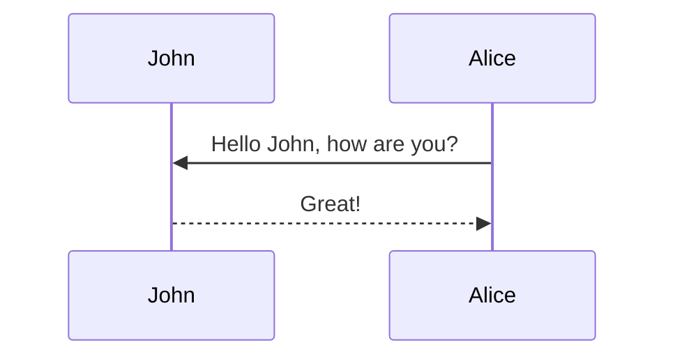

Note: please use the table of contents as defined in the front matter rather than the traditional markdown styling.

## Deployed model = Happy ML Engineer?

You are a machine learning engineer working at a bank. You build a model to grant loans by predicting wether an applicant is likely to default. The model performs extremely well on your test set. The company deploys it, and in the first weeks everything looks great — the model performs just as expected. You receive congratulations, and you feel proud of a job well done.

But… a few months later, performance starts to drop. Repeat applicants have begun adjusting their financial profiles just enough to get approved. They have learned how to game your model. As a result, the new applicants your system sees no longer resemble those in your training data. Simply by deploying your model, you have changed the data distribution. In other words, **your model has triggered a distribution shift**.

Once an ML model is deployed, it undoubtedly has an effect in the real world. Yet, this effect has been largely overlooked in Machine Learning, as deployment is often the _final_ step of the ML pipeline. If we want models to perform reliably in practice, we must take those post-deployment effects into account.

This scenario has been formalized in the field of *Performative Prediction* (PP) <d-cite key="perdomo2020performative"></d-cite>, which studies situations in which deploying a model changes the data on which that model will later be evaluated. Let $$\theta$$ denote the model parameters <d-footnote>Throughout the text, we use $\theta$ to refer both to the model parameters and to the model itself.</d-footnote>. In this setting, the data distribution depends on $$\theta$$ through a *distribution map* $$\mathcal{D}(\theta)$$, a function from parameter space to probability distributions. This formulation contrasts with the traditional machine learning setup, where one assumes a fixed data distribution $$\mathcal{D}$$ independent of the model. Under Performative Prediction, however, the model parameters influence the environment, inducing the very distribution $$\mathcal{D}(\theta)$$ on which the model is subsequently trained. This feedback loop between model deployment and data generation is the key distinguishing feature of the performative setting.



Much of the Performative Prediction literature is highly theoretical, they try to give theoretical guarantees to algorithm that solve the risk minimization problem in this setting. This can be surprising, since the motivation of the field is intrinsically practical — it concerns what happens after a model is put into production. Another consequence of this is that although Performative Prediction is now well recognized as a framework for studying the effects of deployment, its technical details remain relatively inaccessible to the broader ML community. 

The aim of this blog post is to introduce simple visualization techniques that make Performative Prediction research more accesible. Our goals are twofold:
1. to provide a clearer and more approachable explanation of the core technical ideas formalizing Performative Prediction as a two-step iterative process.
2. to help develop practical insights that can be used in practical research. 

## Performative Prediction is a two-step iterative process

In order to characterize this feedback loop between the model and the data distribution, we describe it as an iterative process. Before the process begins, we have an initial data distribution $$\mathcal{D}_0$$, on which the first model $$\theta^{(0)}$$ is trained. From the first model, we get the initial distribution $$\mathcal{D}(\theta^{(0)})$$, the data distribution induced by the model parameters $$\theta^{(0)}$$. At each subsequent time step, we obtain a model $$\theta^{(t+1)}$$ trained on the data distribution $$\mathcal{D}(\theta^{(t)})$$ (see section [Optimization in Performative Prediction]((#how-to-reach-them-optimization-algorithms-in-performative-prediction)) for more information on the optimization algorithms). And then, the model is deployed, which causes a new distribution shift to $$\mathcal{D}(\theta^{(t+1)})$$. This distribution shift is automatic and happens because of the mere deployment of the model:



The fact that the environment reacts to our model makes it difficult to evaluate the performance of the model. In the traditional ML setup, we can measure the performance of a model on a fixed data distribution, but we cannot do this in the Performative Prediction setup.

### How to measure performance of the model then?

In Performative Prediction, evaluating a model’s performance requires acknowledging that the data distribution depends on the model itself. Thus, when the model is updated from $\theta^{(t)}$ to $\theta^{(t+1)}$, we need to measure two different risks: the risk of the updated model $\theta^{(t+1)}$ under the previous distribution $\mathcal{D}(\theta^{(t)})$ (i.e., the distribution before deployment), and the risk of the same model $\theta^{(t+1)}$ under the new distribution $\mathcal{D}(\theta^{(t+1)})$ (i.e., the distribution after the shift). The <em>decoupled performative risk</em> will allow us to do both. For the sake of clarity, we will introduce the notation $$\theta_M$$ to refer to the parameters of the model we want to evaluate and $$\theta_D$$ to refer to the parameters of the the model that defines the data distribution.

The decoupled performative risk is then simply the risk of a model $$\theta_M$$ on the distribution $$\mathcal{D}(\theta_D)$$:

$$ \mathcal{DPR}(\theta_D, \theta_M) := \mathbb{E}_{(x,y) \sim \mathcal{D}(\theta_D)} \big[\ell(\theta_M; x, y)\big] $$

where $$\ell(\theta, x, y)$$ is the loss function of the model $$\theta$$ on the data sample $$(x,y)$$. 

Ultimately, we are, however, mostly interested in the risk of the model on the distribution <em>induced by its own parameters</em>. This risk is referred to as the <em>performative risk</em> and is defined like this:

$$ \mathcal{PR}(\theta) := \mathcal{DPR}(\theta, \theta) = \mathbb{E}_{(x,y) \sim \mathcal{D}(\theta)} [\ell(\theta; x, y)] $$

The performative risk captures the risk after the automatic distribution shift due to model deployment, so after some time the risk will no longer be $$\mathcal{DPR}(\theta^{(t)}, \theta^{(t+1)})$$ but $$\mathcal{PR}(\theta^{(t+1)})$$. Note that compared to the risk in the traditional ML setup, in the performative risk the data distribution is not fixed but depends on $$\theta$$.

<div class="l-screen" style="display: flex; justify-content: center; align-items: center; padding: 40px 0; min-height: 90vh;">
  <div style="background: #FFF8E7; border-radius: 40px; padding: 30px; width: 90%; height: 90%; display: flex; align-items: center; justify-content: center; box-shadow: 0 4px 20px rgba(0,0,0,0.1);">
    <iframe src="{{ 'assets/html/2026-04-27-performative-prediction/risk_iteration_scroll.html' | relative_url }}" 
            frameborder="0" 
            scrolling="yes" 
            width="100%" 
            height="100%" 
            style="border: none; border-radius: 30px; background: transparent;">
    </iframe>
  </div>
</div>

### Visualizing the decoupled risk v2

<div class="l-screen" style="min-height: 90vh;">
  <iframe src="{{ 'assets/html/2026-04-27-performative-prediction/decoupled_risk_landscape.html' | relative_url }}?v=3" 
          frameborder='0' 
          scrolling='no' 
          width="100%" 
          height="100%" 
          style="border: none; background: transparent; min-height: 90vh;">
  </iframe>
</div>

Most works center their analysis on the performative risk <d-footnote> And it is understandable as it is the final objetive of optimization</d-footnote>. Nevertheless, as we saw in the last section, the performative risk is not valid right after the deployment. To have full underdstanding of the optimization landscape, we need to take then a look beyond the performative risk. We introduce a simple visualization technique based on decoupling the predictive model, $\theta_M$, from the model that the distribution reacts to, $\theta_D$, which is used as input for the distribution map: $\mathcal{D}(\theta_D)$.Thoughout this blogpost, we use this visualization to gain insights into questions like: what are the practical differences between an stable and optimal point? How do certain algorithm converge? Or how can we have a sense of convergence if theorical assumptions are not met?

Nevertheless, before introducing the visualization, let us introduce another guiding example: now imagine that you are a ML engineer in a retailer company in charge of training a model that sets the price of the products. The price of the products will undoubtedly affect the demand of the customers to buy the product. Thus, it is useful to formalize this problem as <em>Performative Prediction</em>.

Let's consider the <em>simplified</em> version of this problem introduced by Izzo et al. <d-cite key="izzo2021learn"></d-cite>: let $\theta \in \mathbb{R}$ be the price of $d$ products and $z \in \mathbb{R}$ be the demand of the costumers on buying that individual product. The price of the product affects the demand of that product by $\mathcal{D} = \mathcal{N}(\mu_o - \varepsilon\theta; \Sigma)$, i.e. the demand linearly decreases as the price increases. The retail company is interested maximizing their total revenue ($\theta^T z$), the performative risk is:

$$ PR_{pricing}(\theta) = \mathbb{E}_{z \sim \mathcal{D}(\theta)}[-\theta^T z] $$

Without loss of generality, this example doesn't have an explicit model. It is implicitly coded into the loss function, this simplifies greatly the problem and allows for better understanding. 

To make this concrete, we represent the problem in the decoupled risk landscape.

**Add the second interactive figure**

Note that the performative risk is the section of the plane where $$\theta_M=\theta_D$$. Due to the two-step iterative process, the training of the model, happens in the vertical sections of the plane (where $\theta_D$ is fixed) and the deployment of the distribution shift brings the process back to the performative risk diagonal.

**Now it's easier to see the two step process!**

## Interest points of Performative Prediction
      
One natural solution to the problem of Performative Prediction is deploying a model that — after it has affected the data distribution — does not require retraining, i.e., a model robust to the distribution shift. This model will be optimal for the distribution induced by itself. This point is called performatively stable.

$$ \theta_{ST} = \operatorname*{argmin}_{\theta} \mathbb{E}_{(x,y)\sim \mathcal{D}(\theta_{ST})}[\ell(\theta, x, y)] $$

However, this solution is not optimal for the closed-loop interaction between the data and the model, i.e. it is not the minimum of the performative risk. The minimum of the performative risk is called the performative optimum. 

$$ \theta_{OP} = \operatorname*{argmin}_{\theta} \mathcal{PR}(\theta) = \operatorname*{argmin}_{\theta} \mathbb{E}_{(x,y)\sim \mathcal{D}(\theta)}[\ell(\theta, x, y)] $$

### The new visualization inspires a redefinition of the interest points

The new visualization allows to visualize much better the diference between robustness (stable point) and optimality (optimum point). Keep in mind that both points lie in the $\theta_M=\theta_D=\theta$ section of the decoupled risk landscape, i.e. in the performative risk. 

If when we take the section of the plane with $\theta_D$ fixed for optimization, the minimum of that section is the same as the one that has produced the distirbution, then that point is stable. 



Therefore, the gradient in this direction has to be zero for the point to be stable.

**Proposition 1.** _If_ $\theta_{ST}$ _is a stable point of the performative risk_ $PR(\theta)$, _then_

$$\nabla_M\,\mathit{DR}(\theta_\mathit{ST}, \theta_\mathit{ST}) = 0~.$$

On the other hand, the optimal point of the performative risk is the minimum of the performative risk, i.e. the diagonal section.



Then, the gradient in the diagonal direction has to be zero.

**Proposition 2.** _If_ $PR(\theta)$ _is strictly convex, then_ $\theta_{OP}$ _is an optimal point of the performative risk_ $PR(\theta)$ _if and only if_

$$\nabla_M\,\mathit{DR}(\theta_\mathit{OP}, \theta_\mathit{OP})
    + \nabla_D\,\mathit{DR}(\theta_\mathit{OP}, \theta_\mathit{OP}) = 0~.$$


## How to reach them? Optimization in Performative Prediction
### Algorithms that converge to the stable point

The Performative Prediction literature started out by focusing on how to find <em>the stable solution</em>, as it is more mathematically tractable. The first algorithms were based on _just_ retraining the model after sampling from the new distribution. The process of these algorithms can be summarized as:

1. Get the data samples of the distribution induced by $$\theta^{(t)}$$: $$ (x,y)\sim \mathcal{D}(\theta^{(t)})$$
2. Train the model on those data samples considering the distribution fixed: $$\theta^{(t)} \rightarrow \theta^{(t+1)}$$
3. Deploy the model, causing a new distribution shift: $$\mathcal{D}(\theta^{(t)}) \rightarrow \mathcal{D}(\theta^{(t+1)})$$

If the model is fully optimized at each step, the algorithm us called <em>Repeated Risk Minimization</em> (RRM). Whereas if only one optimizer step is performed, we call it <em>Repeated Gradient Descent</em> (RGD).


Perdomo et al.<d-cite key="perdomo2020performative"></d-cite>, in the founding paper of Performative Prediction, provide convergence guarantees for these algorithms to a stable point. Their analysis relies on two key assumptions. First, the loss function $\ell(\theta; x, y)$ must be convex with respect to the model parameters $\theta$. Second, the distribution map $\mathcal{D}(\theta)$ must be sufficiently sensitive to changes in $\theta$; that is, small variations in the parameters should produce only small variations in the induced data distribution. Formally, this is captured by the condition 

$$\mathcal{W}(\mathcal{D}(\theta_1), \mathcal{D}(\theta_2)) \le \| \theta_1 - \theta_2\|^2 ,$$

where $\mathcal{W}(\cdot, \cdot)$ is the Wasserstein distance of the two distributions.

With our visualization, it is quite intuitive to see why these are needed assumptions: if the loss is convex and the distribution shift is small, the new loss will be also convex. Nevertheless, these are very uncommon in practice, a convex loss is rare and the distribution map is only sensitive if the performative effects are small.  

Note that these algorithms do not use the information of the distribution map when training the model. They just use the data sampled from the shifted distribution. This distribution is considered to be static. Although it is very easy to apply them in practice (wait until the distribution shifts, observe new data samples and retrain), they do not find the optimal solution, as they do not use explicit information of the distribution map while retraining the model. In these initial algorithms, the only guarantee to optimality is that the stable point might lie close to the optimal point under certain conditions, which are even more strict then the convergence to the stable point.

### Algorithms that converge to the optimal point

Later, the literature started focusing on how to find the optimal solution directly. The most immidiate idea is to apply gradient descent to the performative risk — Performative Gradient Descent (PerfGD). The key step here is to calculate the performative gradient:

$$ \nabla_{\theta} PR(\theta) = \nabla_{\theta} \mathbb{E}_{(x,y) \sim \mathcal{D}(\theta)} [\ell(\theta; x, y)]~. $$ 
      
This gradient is difficult to calculate due to the dependency of the data distribution on the model parameters<d-footnote>When finding the stable point, one need only to calculate $$\mathbb{E}_{(x,y) \sim \mathcal{D}(\theta)} [ \nabla_{\theta} \ell(\theta; x, y)]$$ because the distribution is considered static; that is why it is more mathematically tractable.</d-footnote>. Two possibilities have been proposed<d-footnote>As both $x$, $y$ can be changed due to the dristibution map, we consider the notation $z=(x,y)$ from now on.</d-footnote>: 

1. REINFORCE<d-cite key="izzo2021learn"></d-cite>: uses the fact that the gradient of the likelihood of a random variable is (approximately)  the same as the likihood times the gradient of the log likelihood $\nabla_{\theta} p_{\theta}(z) \approx p_{\theta}(z)\nabla_{\theta}\log p_{\theta}(z)$. 

$$
\begin{align}
 \nabla_\theta PR(\theta) &= \nabla_\theta \int \ell(\theta;z) p_{\mathcal{D}(\theta)}(z) dz \nonumber \\
&= \int \frac{\partial \ell(\theta;z)}{\partial \theta}   p_{\mathcal{D}(\theta)}(z)dz + \int  \ell(\theta;z)  \frac{\partial p_{\mathcal{D}(\theta)}(z)}{\partial \theta}dz\nonumber\\
& = \int \frac{\partial \ell(\theta;z)}{\partial \theta}   p_{\mathcal{D}(\theta)}(z)dz + \int  \ell(\theta;z)   \frac{\partial \log p_{\mathcal{D}(\theta)}(z)}{\partial \theta} p_{\mathcal{D}(\theta)}(z)dz \nonumber \\
&=\mathbb{E}_{z \sim \mathcal{D}(\theta)} \left[\frac{\partial \ell(\theta;z)}{\partial \theta} \right] + \mathbb{E}_{z \sim \mathcal{D}(\theta)} \left[ \ell(\theta;z)\frac{\partial \log p_{\mathcal{D}(\theta)}(z)}{\partial \theta} \right] \nonumber\\
&=\mathbb{E}_{z \sim \mathcal{D}(\theta)} \left[\frac{\partial \ell(\theta;z)}{\partial \theta} + \ell(\theta;z)\frac{\partial \log p_{\mathcal{D}(\theta)}(z)}{\partial \theta} \right] 
\end{align}
$$
2. Reparametrization trick<d-cite key="cyffers2024optimal"></d-cite>: uses a deterministic function that is dependent in a base distribution and encodes the transformation caused by the parameter. Therefore, the expectation depends on the base-distribution only. In the case of PP, this is achievable by defining a base distribution \(\mathcal{D}(\theta)\) that captures the samples before performativity and push-forward model that defines the transformation of each sample due to performativity $z = \varphi(z_o, \theta)$. We can then use the multivariate chain rule to calculate the performative gradient

$$ 
  \begin{align}
      \nabla_\theta PR(\theta) &= \nabla_\theta \mathbb{E}_{z \sim \mathcal{D}(\theta)} \big[ \ell(\theta;z)\big] \nonumber \\
    & = \nabla_\theta \mathbb{E}_{z_o \sim \mathcal{D}_o} \big[ \ell(\varphi(z_o, \theta); \theta)\big] \nonumber \\
    &=  \mathbb{E}_{z_o \sim \mathcal{D}_o} \Big[ \nabla_\theta \ell(\varphi(z_o, \theta); \theta)\Big] \nonumber \\
    & = \mathbb{E}_{z_0 \sim \mathcal{D}_0} \left[ \left.\frac{\partial \ell(\theta;z)}{\partial \theta}\right|_{z=\varphi(z_0; \theta)}  + \left.\frac{\partial \ell(\theta;z)}{\partial z}\right|_{z=\varphi(z_0; \theta)} \frac{\partial \varphi(z_0;\theta)}{\partial \theta} \right]
  \end{align} 
$$

### Visualization of the algorithms in the decoupled risk landscape

The figure illustrates the convergence behavior of the different algorithms for the pricing example in the decoupled risk landscape. Importantly, the performative risk cannot be optimized directly. Optimization does not proceed along the diagonal of the landscape because the problem is inherently a two-step process: first a model is trained ($\theta_M$ is updated and we move on the vertical section of the plane) and then the distribution shift occurs only *after* the model is deployed (($\theta_D$ is updated and we move on the horizontal section of the plane)). As before, we keep the same color scheme from previous visualizations to facilitate comparison and interpretation.



## Some _more practical_ examples

**This is a working process section, as we might add some more experiments** 

One of the biggest assumptions for convergence of the Performative Prediction algorithms is convexity of the loss function $l(\theta; x,y)$ with respect to the model weights<d-footnote>As far as we are concerned, there is only one work considering convergence to non-convex losses in Performative Prediction. They prove convergence to a relaxation of our redefinition of the stable point.<d-footnote>. Nevertheless, this setup is not realistic at all. Specially in modern state-of-the-art deep learning model, where the loss landscape is multidimensional and non-convex. Typically in this setups, the focus is shifted from convergence to the global mimum to finding solutions that perform well. We believe that this is the right direction from Performative Prediction if we want to add practically to the field. In that sense, our redefinition of the stable and optimal points can be used as a metric to know if a good solutions were found.

Let's extend the pricing example to $d=100$ products. Now, $\theta, z \in \mathbb{R}^d$. The stable point ($\theta_{ST} = \frac{\mu_0}{\epsilon}$) and optimal point ($\theta_{OP} = \frac{\mu_0}{2\epsilon}$) can be computed closed-form <d-footnote>Please refer to Izzo et al. <d-cite key="izzo2021learn"></d-cite>, where this example comes, for full details on this derivation</d-footnote>.



To check how good the algorithms perform, we plot the distance to the optimal point. RGD only converges to the stable point whereas PerfGD converges to the optimal. We suspect the REINFORCE variant of PerfGD struggles in the high-dimensionality case because the variance of the REINFORCE approach is too high for it to get a good estimate of the gradient. In any case, based on our experience with both versions of PerfGD, we recommend to use the reparametrization one. We can see how the gradients confirm this. In RGD, only $\nabla_M DPR$ goes to zero. In contrast, with PerfGD neither of $\nabla_M DPR$ nor $\nabla_D DPR$ go to zero, but their sum $\nabla DPR$ does because both of the components go in oposite directions. 

Let's also consider the bank loan example. We use the Give me some credit dataset <d-cite key="GiveMeSomeCredit"></d-cite>, which was established by Perdomo et al. <d-cite key="perdomo2020performative"></d-cite> as the default dataset of PP. This tabular dataset describes if a loan was returned ($y=0$) or defaulted ($y=1$) based on financial features of applicants ($x\in\mathbb{R}^{11}$). As standard in PP, we equip the dataset with a transformation function $\Gamma$ based on strategic classification. Instead of using logistic regression, we use a nonlinear classifier (a 2-layer multi-layer perceptron MLP) as a model. 



In this case, RGD converges to the stable point and PerfGD to the optimal because both gradients go to zero.

The gradient has been used heuristically in realistic optimization machine learning problems like Deep Learning as a debugging metric for training. We believe that our redifinition of the interest points allows this for the first time in PP. This is specially relevant to account for realistic scenarios with non-convex losses or no sesitivities guarantees on the distribution map.

## A final thought on practical Performative Prediction

We could conclude the blogpost at this point. We have clarified why PP is a relevant problem, introduced the core ideas of the field to a broader ML audience, and proposed metrics that can be directly applied in practical scenarios. However, the blogpost format gives us space to reflect more broadly. In particular, we would like to use this opportunity to discuss the challenges ahead and outline what we see as meaningful next steps for practical research on PP within the community.

Performative Prediction is, in many ways, a cursed field. Its motivation is fundamentally practical—models deployed in the world influence the data they will later learn from—yet practical research faces severe, structural limitations. To converge to the truly relevant performative optimum, we need information about the distribution map $\mathcal{D}(\theta)$, which governs how the environment shifts in response to a model’s predictions. Recall that PP is a two-step iterative process: (1) train a model, (2) deploy it and observe the induced distribution shift. Most existing works focus on the first step, proposing algorithms that optimize under the assumption that either (a) the distribution map is known, or (b) it can be reliably estimated from samples. The core barrier to practical PP is that in realistic settings, we have very limited visibility into how deployment shifts the data. Estimating $\mathcal{D}(\theta)$ from samples alone is difficult or ethically constrained. Once a model is deployed, it is typically fixed, and deploying multiple models across different populations solely to collect data for estimation would be highly unethical.

Miller et al.<d-cite key="pmlr-v139-miller21a"></d-cite> take the first step toward estimating the distribution map, though their analysis is limited to linear location-scale family of distribution. More recently, Bracale et al.<d-cite key="bracale2024learning"></d-cite> approach the problem using causal tools. We believe that this is a highly promising research direction and that the PP literature stands to benefit substantially from drawing tighter connections with variational inference. Both fields share the challenge of approximating complex, latent distributions under limited information; exploring this intersection could unlock new, practically viable approaches to estimating $\mathcal{D}(\theta)$.

To see where practical research may currently be more feasible, reconsider the bank lending example. The model predicts a borrower’s default risk, and the bank uses this prediction to decide whether to grant the loan *and* at what interest rate. The interest rate, in turn, affects the borrower’s ability to repay, meaning that the outcome $y$ changes as a consequence of the model’s prediction $\hat{y}$, even if the features $x$ remain the same. This setting is known as outcome performativity<d-cite key="kim2023making"></d-cite>. Crucially, it is often possible to collect data that reflects this effect, because the outcome is shaped by decision rules already in operational use. For this reason, we argue that Performative Prediction research may be more practically impactful when focused on outcome performativity. The ethical and feasibility limitations discussed above are significantly reduced, and the feedback loop can be studied in realistic, deployment-aligned scenarios.

## Conclusion

Now imagine you are a machine learning engineer working in the company of your dreams. You have been hired some time ago and you are excited because you worked on the next big thing. The soon-to-be-released model that works amazingly well in your test sets — AGI is just around the corner! But… have you considered the effects that this model will have on the data distribution? If the internet is populated with text and images created by your model… you might not be able to train the next model.

And it seems that retraining is not enough…


## Equations

This theme supports rendering beautiful math in inline and display modes using [MathJax 3](https://www.mathjax.org/) engine.
You just need to surround your math expression with `$$`, like `$$ E = mc^2 $$`.
If you leave it inside a paragraph, it will produce an inline expression, just like $$ E = mc^2 $$.

To use display mode, again surround your expression with `$$` and place it as a separate paragraph.
Here is an example:

$$
\left( \sum_{k=1}^n a_k b_k \right)^2 \leq \left( \sum_{k=1}^n a_k^2 \right) \left( \sum_{k=1}^n b_k^2 \right)
$$

Note that MathJax 3 is [a major re-write of MathJax](https://docs.mathjax.org/en/latest/upgrading/whats-new-3.0.html)
that brought a significant improvement to the loading and rendering speed, which is now
[on par with KaTeX](http://www.intmath.com/cg5/katex-mathjax-comparison.php).

## Images and Figures

Its generally a better idea to avoid linking to images hosted elsewhere - links can break and you
might face losing important information in your blog post.
To include images in your submission in this way, you must do something like the following:

```markdown

```

which results in the following image:



To ensure that there are no namespace conflicts, you must save your asset to your unique directory
`/assets/img/2025-04-27-[SUBMISSION NAME]` within your submission.

Please avoid using the direct markdown method of embedding images; they may not be properly resized.
Some more complex ways to load images (note the different styles of the shapes/shadows):

<div class="row mt-3">
    <div class="col-sm mt-3 mt-md-0">
        
    </div>
    <div class="col-sm mt-3 mt-md-0">
        
    </div>
</div>
<div class="caption">
    A simple, elegant caption looks good between image rows, after each row, or doesn't have to be there at all.
</div>

<div class="row mt-3">
    <div class="col-sm mt-3 mt-md-0">
        
    </div>
    <div class="col-sm mt-3 mt-md-0">
        
    </div>
</div>

<div class="row mt-3">
    <div class="col-sm mt-3 mt-md-0">
        
    </div>
    <div class="col-sm mt-3 mt-md-0">
        
    </div>
    <div class="col-sm mt-3 mt-md-0">
        
    </div>
</div>

### Interactive Figures

Here's how you could embed interactive figures that have been exported as HTML files.
Note that we will be using plotly for this demo, but anything built off of HTML should work
(**no extra javascript is allowed!**).
All that's required is for you to export your figure into HTML format, and make sure that the file
exists in the `assets/html/[SUBMISSION NAME]/` directory in this repository's root directory.
To embed it into any page, simply insert the following code anywhere into your page.

```markdown

```

For example, the following code can be used to generate the figure underneath it.

```python
import pandas as pd
import plotly.express as px

df = pd.read_csv('https://raw.githubusercontent.com/plotly/datasets/master/earthquakes-23k.csv')

fig = px.density_mapbox(
    df, lat='Latitude', lon='Longitude', z='Magnitude', radius=10,
    center=dict(lat=0, lon=180), zoom=0, mapbox_style="stamen-terrain")
fig.show()

fig.write_html('./assets/html/2026-04-27-distill-example/plotly_demo_1.html')
```

And then include it with the following:

```html

<div class="l-page">
  <iframe
    src="{{ 'assets/html/2026-04-27-distill-example/plotly_demo_1.html' | relative_url }}"
    frameborder="0"
    scrolling="no"
    height="600px"
    width="100%"
  ></iframe>
</div>

```

Voila!

<div class="l-page">
  <iframe src="{{ 'assets/html/2026-04-27-distill-example/plotly_demo_1.html' | relative_url }}" frameborder='0' scrolling='no' height="600px" width="100%"></iframe>
</div>

## Citations

Citations are then used in the article body with the `<d-cite>` tag.
The key attribute is a reference to the id provided in the bibliography.
The key attribute can take multiple ids, separated by commas.

The citation is presented inline like this: <d-cite key="gregor2015draw"></d-cite> (a number that displays more information on hover).
If you have an appendix, a bibliography is automatically created and populated in it.

Distill chose a numerical inline citation style to improve readability of citation dense articles and because many of the benefits of longer citations are obviated by displaying more information on hover.
However, we consider it good style to mention author last names if you discuss something at length and it fits into the flow well — the authors are human and it’s nice for them to have the community associate them with their work.

---

## Footnotes

Just wrap the text you would like to show up in a footnote in a `<d-footnote>` tag.
The number of the footnote will be automatically generated.<d-footnote>This will become a hoverable footnote.</d-footnote>

---

## Code Blocks

This theme implements a built-in Jekyll feature, the use of Rouge, for syntax highlighting.
It supports more than 100 languages.
This example is in C++.
All you have to do is wrap your code in a liquid tag:


 <br/> code code code <br/> 


The keyword `linenos` triggers display of line numbers. You can try toggling it on or off yourself below:



int main(int argc, char const \*argv[])
{
string myString;

    cout << "input a string: ";
    getline(cin, myString);
    int length = myString.length();

    char charArray = new char * [length];

    charArray = myString;
    for(int i = 0; i < length; ++i){
        cout << charArray[i] << " ";
    }

    return 0;

}



---

## Diagrams

This theme supports generating various diagrams from a text description using [mermaid.js](https://mermaid-js.github.io/mermaid/){:target="\_blank"} directly.
Below, we generate examples of such diagrams using [mermaid](https://mermaid-js.github.io/mermaid/){:target="\_blank"} syntax.

**Note:** To enable mermaid diagrams, you need to add the following to your post's front matter:

```yaml
mermaid:
  enabled: true
  zoomable: true # optional, for zoomable diagrams
```

The diagram below was generated by the following code:


````

````


---

## Tweets

An example of displaying a tweet:


An example of pulling from a timeline:


For more details on using the plugin visit: [jekyll-twitter-plugin](https://github.com/rob-murray/jekyll-twitter-plugin)

---

## Blockquotes

<blockquote>
    We do not grow absolutely, chronologically. We grow sometimes in one dimension, and not in another, unevenly. We grow partially. We are relative. We are mature in one realm, childish in another.
    —Anais Nin
</blockquote>

---

## Layouts

The main text column is referred to as the body.
It is the assumed layout of any direct descendants of the `d-article` element.

<div class="fake-img l-body">
  <p>.l-body</p>
</div>

For images you want to display a little larger, try `.l-page`:

<div class="fake-img l-page">
  <p>.l-page</p>
</div>

All of these have an outset variant if you want to poke out from the body text a little bit.
For instance:

<div class="fake-img l-body-outset">
  <p>.l-body-outset</p>
</div>

<div class="fake-img l-page-outset">
  <p>.l-page-outset</p>
</div>

Occasionally you’ll want to use the full browser width.
For this, use `.l-screen`.
You can also inset the element a little from the edge of the browser by using the inset variant.

<div class="fake-img l-screen">
  <p>.l-screen</p>
</div>
<div class="fake-img l-screen-inset">
  <p>.l-screen-inset</p>
</div>

The final layout is for marginalia, asides, and footnotes.
It does not interrupt the normal flow of `.l-body`-sized text except on mobile screen sizes.

<div class="fake-img l-gutter">
  <p>.l-gutter</p>
</div>

---

## Other Typography?

Emphasis, aka italics, with _asterisks_ (`*asterisks*`) or _underscores_ (`_underscores_`).

Strong emphasis, aka bold, with **asterisks** or **underscores**.

Combined emphasis with **asterisks and _underscores_**.

Strikethrough uses two tildes. ~~Scratch this.~~

1. First ordered list item
2. Another item

- Unordered sub-list.

1. Actual numbers don't matter, just that it's a number
   1. Ordered sub-list
2. And another item.

   You can have properly indented paragraphs within list items. Notice the blank line above, and the leading spaces (at least one, but we'll use three here to also align the raw Markdown).

   To have a line break without a paragraph, you will need to use two trailing spaces.
   Note that this line is separate, but within the same paragraph.
   (This is contrary to the typical GFM line break behavior, where trailing spaces are not required.)

- Unordered lists can use asterisks

* Or minuses

- Or pluses

[I'm an inline-style link](https://www.google.com)

[I'm an inline-style link with title](https://www.google.com "Google's Homepage")

[I'm a reference-style link][Arbitrary case-insensitive reference text]

[I'm a relative reference to a repository file](../blob/master/LICENSE)

[You can use numbers for reference-style link definitions][1]

Or leave it empty and use the [link text itself].

URLs and URLs in angle brackets will automatically get turned into links.
http://www.example.com or <http://www.example.com> and sometimes
example.com (but not on Github, for example).

Some text to show that the reference links can follow later.

[arbitrary case-insensitive reference text]: https://www.mozilla.org
[1]: http://slashdot.org
[link text itself]: http://www.reddit.com

Here's our logo (hover to see the title text):

Inline-style:


Reference-style:
![alt text][logo]

[logo]: https://github.com/adam-p/markdown-here/raw/master/src/common/images/icon48.png "Logo Title Text 2"

Inline `code` has `back-ticks around` it.

```javascript
var s = "JavaScript syntax highlighting";
alert(s);
```

```python
s = "Python syntax highlighting"
print(s)
```

```
No language indicated, so no syntax highlighting.
But let's throw in a <b>tag</b>.
```

Colons can be used to align columns.

| Tables        |      Are      |  Cool |
| ------------- | :-----------: | ----: |
| col 3 is      | right-aligned | $1600 |
| col 2 is      |   centered    |   $12 |
| zebra stripes |   are neat    |    $1 |

There must be at least 3 dashes separating each header cell.
The outer pipes (|) are optional, and you don't need to make the
raw Markdown line up prettily. You can also use inline Markdown.

| Markdown | Less      | Pretty     |
| -------- | --------- | ---------- |
| _Still_  | `renders` | **nicely** |
| 1        | 2         | 3          |

> Blockquotes are very handy in email to emulate reply text.
> This line is part of the same quote.

Quote break.

> This is a very long line that will still be quoted properly when it wraps. Oh boy let's keep writing to make sure this is long enough to actually wrap for everyone. Oh, you can _put_ **Markdown** into a blockquote.

Here's a line for us to start with.

This line is separated from the one above by two newlines, so it will be a _separate paragraph_.

This line is also a separate paragraph, but...
This line is only separated by a single newline, so it's a separate line in the _same paragraph_.
